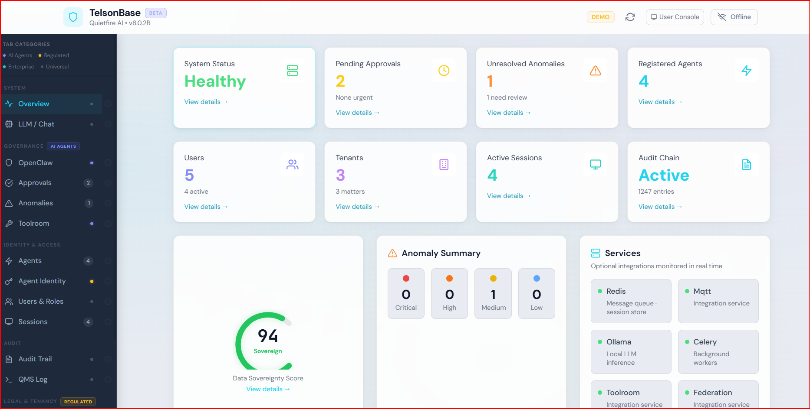
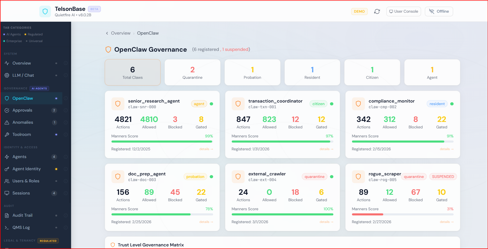
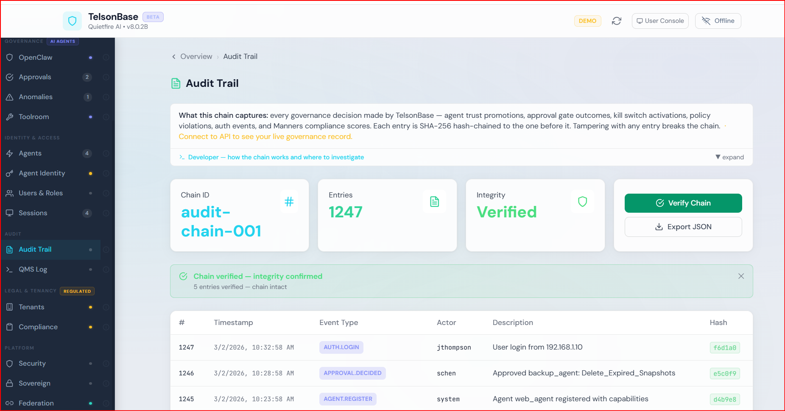
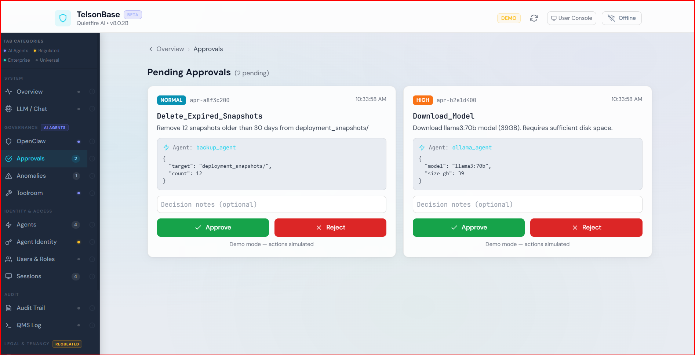
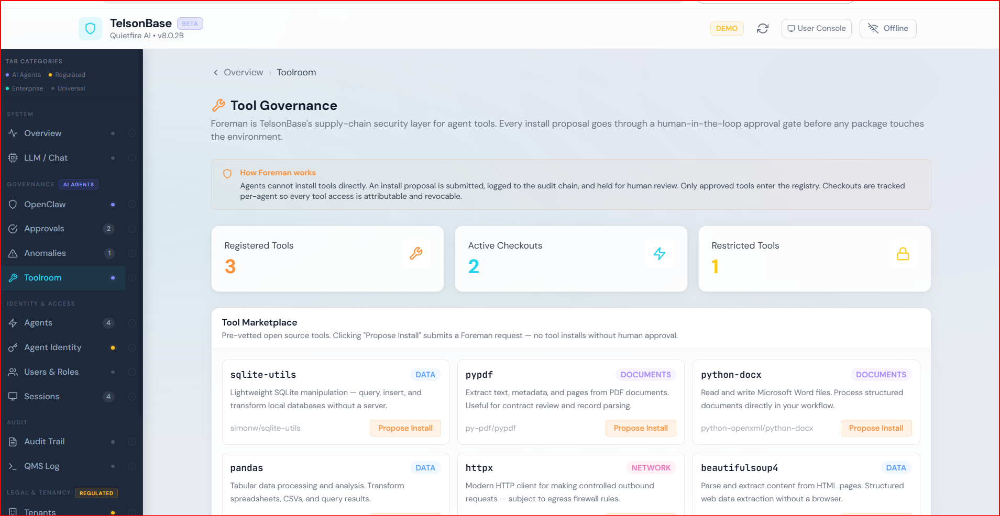

# ClawCoat

### Control Your Claw. Trust Is Earned.

Every MCP tool call an AI agent makes, ClawCoat intercepts it, evaluates it, and decides: allow, gate for human approval, or block. Before execution. Every time. That is active decision making, and it is what separates governance from logging.

ClawCoat is the working implementation of the Agent Autonomy SLA, a formal per-agent commitment framework defining what an autonomous agent may do, under what conditions, and with what audit trail. Jouneaux et al. identified this as an open challenge in November 2025 ([arXiv:2511.02885](https://arxiv.org/abs/2511.02885)). ClawCoat is the answer.

Five trust tiers, earned by behavior. An 8-factor Manners Engine scores every agent continuously and demotes bad actors automatically. Human-in-the-loop gates block high-risk calls until a human decides. A cryptographic audit chain records every governance decision. Nothing leaves your network.

Self-hosted. Open source. Apache 2.0. [clawcoat.com](https://clawcoat.com)

> *"The industry gave AI agents the keys to everything before anyone asked who was watching."*

<p align="center">
  <strong>v11.0.1</strong> &nbsp;|&nbsp;
  <strong>746 tests passing</strong> &nbsp;|&nbsp;
  <strong>51 SOC 2 controls</strong> &nbsp;|&nbsp;
  <strong>161 API endpoints</strong> &nbsp;|&nbsp;
  <strong>0 data shared</strong>
</p>

<p align="center">
  <a href="docs/Operation%20Documents/DEVELOPER_GUIDE.md">Developer Guide</a> &nbsp;|&nbsp;
  <a href="docs/System%20Documents/API_REFERENCE.md">API Reference</a> &nbsp;|&nbsp;
  <a href="docs/System%20Documents/SECURITY_ARCHITECTURE.md">Security Architecture</a> &nbsp;|&nbsp;
  <a href="docs/FAQ.md">FAQ</a> &nbsp;|&nbsp;
  <a href="docs/AMBASSADORS.md">Ambassador Program</a>
</p>

<p align="center">
  <a href="https://github.com/QuietFireAI/TelsonBase/actions/workflows/ci.yml"></a>
  &nbsp;
  
  &nbsp;
  
  &nbsp;
  <a href="https://huggingface.co/spaces/QuietFireAI/TelsonBase"></a>
  &nbsp;
  <a href="https://buymeacoffee.com/jphillips"></a>
  &nbsp;
  <a href="https://doi.org/10.5281/zenodo.19004787"></a>
</p>

---

## Status: Live

**746 system level tests all PASS. 0 high-severity findings. Everything described in this README is built and running.**

**Try the live demo:** [huggingface.co/spaces/QuietFireAI/TelsonBase](https://huggingface.co/spaces/QuietFireAI/TelsonBase)

The governance engine, trust pipeline, compliance infrastructure, and admin dashboard are fully functional. The integration guide covers the full agent flow end-to-end and has been verified across multiple clean-slate deployments.

**What's stable and tested:**
Trust governance pipeline · Cryptographic audit chain · RBAC (150 endpoints) · Human-in-the-loop approval gates · Kill switch · Manners compliance engine · Multi-tenant isolation · SOC 2 / HIPAA / HITRUST / CJIS compliance frameworks · Admin dashboard · OpenClaw governance proxy

**What's actively being worked on:**
User management live endpoint · QMS real-time log feed · Audit chain PostgreSQL archival beyond 100K entries · Agent actor attribution in approval decisions · Identiclaw agent testing

If something is broken, [open an issue](../../issues). If something is missing that you need, [start a discussion](../../discussions). If you want to contribute, read [CONTRIBUTING.md](CONTRIBUTING.md).

---

## What Is TelsonBase?

TelsonBase is a **self-hosted, governance-first trust enabled platform** for autonomous AI agents. It acts as a governed MCP proxy: agents connect to TelsonBase, and every action they attempt is evaluated against trust levels, Manners compliance, anomaly detection, and approval gates before execution. The agent is never modified. TelsonBase wraps it.

---

## Quick Start

```bash
# Clone
git clone https://github.com/QuietFireAI/TelsonBase.git
cd telsonbase

# Configure
cp .env.example .env
# Edit .env: set MCP_API_KEY, JWT_SECRET_KEY (openssl rand -hex 32)

# Start
docker compose up --build -d

# Initialize database schema (required on first run)
docker compose exec mcp_server alembic upgrade head

# Verify
curl http://localhost:8000/health

# Run tests
docker compose exec mcp_server python -m pytest tests/ -v --tb=short
```

| Service | URL | Purpose |
|---|---|---|
| **API** | `http://localhost:8000` | Main API + interactive docs at /docs |
| **Dashboard** | `http://localhost:8000/dashboard` | Security management console |
| **MCP Gateway** | `http://localhost:8000/mcp` | Goose / Claude Desktop agent interface |
| **Open-WebUI** | `http://localhost:3000` | Chat with local LLMs |
| **Grafana** | `http://localhost:3001` | Monitoring dashboards |

---

## The 8-Step Governance Pipeline

Every action, every time:

```
Step 1: Instance registered?         Reject if unknown
Step 2: KILL SWITCH (suspended?)     Reject immediately
Step 3: Nonce replay protection      Reject if replayed
Step 4: Tool on blocklist?           Reject if blocked
Step 5: Classify action category     READ / WRITE / DELETE / EXTERNAL / FINANCIAL / SYSTEM
Step 6: Manners compliance score        Auto-quarantine if < 0.25 or 3+ violations / 24h
Step 7: Trust level permission       Allow / Gate / Block per matrix
Step 8: Anomaly detection            Flag behavioral deviations
```

The kill switch is checked at Step 2 -- before trust levels, before Manners, before everything except "does this agent exist?" One API call suspends any agent. All actions rejected. Only a human can reinstate it.

---

## See It Working

Everything below is a live instance. No mocks. No scripted responses. Real governance pipeline, real audit chain, real decisions.

---

**GIF 1 - Policy Block**
QUARANTINE agent attempts an external financial API call. TelsonBase blocks it before execution. Decision written to the tamper-evident audit chain. Agent never touched the endpoint.


---

**GIF 2 - Kill Switch**
QUARANTINE agent fires an action - governance gates it, queues a human approval. Operator identifies suspicious behavior and hits the kill switch. Agent suspended. Subsequent action attempt hard-blocked. The gate, the suspension, and the block are all separate entries in the immutable audit chain.


---

**GIF 3 - Human-in-the-Loop: Approve**
PROBATION agent attempts an external http_post. TelsonBase holds it - cannot execute without human review. Operator reviews the full payload in the approval dashboard and approves. `::_Thank_You::` logged to the audit chain - the QMS™ command block for successful completion, attributed to the operator, hash-chained to every event before it. The agent's action goes through. Trust, verified.


---

**GIF 4 - Human-in-the-Loop: Reject**
The other side of the gate. Pending approval from a suspended agent - full payload, URGENT flag, operator identity visible. Human reviews, rejects. Approval queue clears to zero. `::_Thank_You_But_No::` logged to the audit chain - the QMS™ command block for refusal, attributed to the human operator, timestamped, hash-chained to every event before it. Not just agent actions. Human decisions too.


---

**GIF 5 - Manners Scoring: Behavioral Score Drops in Real Time**
Fresh agent registers at a Manners score of 1.0. Attempts `payment_send` - blocked (it's on the agent's blocklist). Score drops to 0.95. Attempts `transaction_execute` - blocked again (wrong trust tier for financial actions). Score drops to 0.91. Two violations, two different block reasons, one continuous behavioral record. The governance pipeline doesn't just block - it remembers.


---

**GIF 6 - Trust Tiers: Earned Promotion Unlocks Actions**
Fresh agent at QUARANTINE attempts `file_write` - blocked outright. Promoted to PROBATION - same action now triggers a HITL gate (human approval required, approval ID generated). Promoted to RESIDENT - same action, same agent, now executes autonomously. Three tiers, three outcomes, zero code changes. The agent didn't change. The governance did.


---

## Screenshots

**Admin Dashboard - system health, audit chain status, anomaly summary at a glance**


**Agent Governance - agents across trust tiers with live Manners scores and the full Trust Level Governance Matrix**
*`invoice_agent` is at Quarantine, `analytics_agent` at Probation. Trust is earned -not assumed.*


**Audit Trail - 500 SHA-256 hash-chained entries, tamper-evident and export-ready**



<details>
<summary>More screenshots - Approvals, Toolroom, Users & Roles</summary>

**Human-in-the-Loop Approval Gates**


**Toolroom - supply-chain security for agent tools, every install proposal gated**



</details>

---

## The Secret Sauce: Earned Trust

Every other platform gives agents permissions and hopes for the best. TelsonBase does the opposite. Every agent starts at **Quarantine** with zero autonomous permissions and earns its way up.

```
QUARANTINE ──► PROBATION ──► RESIDENT ──► CITIZEN ──► AGENT
 (all gated)  (internal ok) (read/write)  (autonomous) (apex)

  Promotion: sequential, human-approved, earned
  Demotion:  instant, skip-capable, automatic on bad behavior
```

| Trust Level | Autonomous | Requires Approval | Blocked |
|---|---|---|---|
| **Quarantine** | Nothing | Everything | Destructive, external |
| **Probation** | Read-only internal | External calls, writes | Destructive |
| **Resident** | Read/write internal | Financial, delete, new domains | -- |
| **Citizen** | All allowed tools | Anomaly-flagged only | -- |
| **Agent** | Full autonomy (300 actions/min) | Nothing | Nothing |

Promotion is sequential. You can't skip from Quarantine to Citizen. Demotion is instant and can skip levels. Every agent receives a real-time Manners compliance score (0.0-1.0). An agent scoring below 0.25 - or triggering three violations in any 24-hour window - is automatically suspended and quarantined. No human delay. No grace period. Agent is the apex tier - fully verified, human-approved designation with the strictest re-verification requirements.

This is the architecture the industry needs. Not more guardrails inside the model. **Deterministic enforcement outside the model** that doesn't care if the LLM is being prompt-injected.

---

## What's Already Built

This isn't a roadmap. This is shipped code with tests.

| Capability | Implementation | Tests |
|---|---|---|
| **Trust Level Governance** | 5-tier earned trust, sequential promotion, instant demotion | 54 |
| **Cryptographic Audit Trail** | SHA-256 hash-chained, tamper-evident | 11 |
| **150 RBAC Endpoints** | 4-tier permissions, deny overrides allow | 13 |
| **AES-256-GCM Encryption** | At-rest encryption, PBKDF2 key derivation | 11 |
| **TOTP Multi-Factor Auth** | RFC 6238, QR enrollment, backup codes | 8 |
| **Behavioral Anomaly Detection** | Rate spikes, capability probes, enumeration | 12 |
| **Human-in-the-Loop Gates** | Approval workflows with timeouts, escalation | 9 |
| **Manners Compliance Engine** | Five behavioral principles, runtime scoring | 7 |
| **Egress Firewall** | Domain whitelist, external call governance | 5 |
| **Multi-Tenant Isolation** | Redis key namespacing, litigation holds | 8 |
| **Agent Identity** | DID-based identity, Ed25519, verifiable credentials (engine built; Identiclaw service binding is post-launch - see `docs/WHATS_NEXT.md`) | 50 |
| **OpenClaw Governance** | Governed MCP proxy, kill switch, Manners auto-demotion | 55 |
| **Session Management** | HIPAA-compliant idle timeout, privileged role limits | 6 |
| **Federation** | Cross-instance trust with mTLS, RSA-4096 signatures | 5 |
| **Kill Switch** | Instant suspension, Redis-persisted, survives restarts | 7 |
| **MCP Gateway (Goose)** | 13 tools exposed via MCP, trust-gated sessions, native Goose / Claude Desktop integration | live |

**Total: 746 tests passing. 1 skipped. 0 high-severity findings across 61,278 lines scanned.**

---

## Compliance Frameworks (Already Baked In)

| Framework | Status | Coverage |
|---|---|---|
| **SOC 2 Type I** | 51 controls documented | 5 Trust Service Criteria, evidence mapped to source |
| **HIPAA Security Rule** | Full mapping | Administrative, Physical, Technical, Organizational |
| **HITRUST CSF** | 12 domains | Baseline controls, risk scoring, gap analysis |
| **CJIS** | Mapped | Advanced auth, media protection, audit controls |
| **GDPR** | Mapped | Data minimization, encryption, right to erasure |
| **PCI DSS** | Mapped | Encryption, segmentation, access control, logging |
| **ABA Model Rules** | Mapped | Rules 1.6, 1.7/1.10, 5.3, Formal Opinion 512 |
| **HITECH Act** | Mapped | Breach notification, 60-day tracking, safe harbor |

Every control references a source file and a passing test. Run `proof_sheets/` to verify any claim.

---

## Who This Is For

**The regulated industries -law firms, healthcare, insurance, accounting -TelsonBase was built against the standards they operate under.** HIPAA. SOC 2. HITRUST. CJIS. GDPR. PCI DSS. ABA Model Rules. Attorney-client privilege. Protected health information. Financial records. The kind of data where "we'll figure out security later" means malpractice, regulatory action, or worse. The compliance mappings are in the repository because if it holds up to those frameworks, it works everywhere below them.

**Small businesses** get the same platform. Five employees or fifty -every agent action is governed, every decision logged, every permission earned. No enterprise contract required.

And anyone running agents who simply wants to stay in control of their data. Your own agents, local inference via Ollama, everything on your hardware. No subscription. No data harvesting. No terms that change. Access it from your home network or your phone.

It runs on a $200 mini-PC, a Raspberry Pi, a homelab server, or a cloud VM. The platform that qualifies for a law firm's security review runs on the same Docker Compose as your home server. That's intentional.

---

## Connecting Goose (or Any MCP Client)

TelsonBase ships a native MCP gateway at `/mcp`. [Goose](https://github.com/block/goose) by Block connects to it out of the box. No plugin, no glue code, no n8n. The configuration file is included.

**Three steps:**

```bash
# 1. Copy the included config to Goose's config directory
cp goose.yaml ~/.config/goose/config.yaml

# 2. Set your API key in the config (the key from your .env MCP_API_KEY)
# Edit ~/.config/goose/config.yaml - replace REPLACE_WITH_YOUR_TELSONBASE_API_KEY

# 3. Start a Goose session
goose session start
```

Goose will discover all 13 tools automatically via MCP tool discovery. From there, natural language:

```
> What is the TelsonBase system status?
> List all pending approval requests
> Show me the agents in quarantine
> Approve request req_abc123
```

**13 MCP Tools available to connected clients:**

| Tool | Category | Min Trust Level |
|---|---|---|
| `get_health` | System | Any |
| `system_status` | System | Any |
| `register_as_agent` | Agents | Any |
| `list_agents` | Agents | QUARANTINE+ |
| `get_agent` | Agents | QUARANTINE+ |
| `get_audit_chain_status` | Audit | QUARANTINE+ |
| `verify_audit_chain` | Audit | QUARANTINE+ |
| `get_recent_audit_entries` | Audit | QUARANTINE+ |
| `list_pending_approvals` | Approvals | QUARANTINE+ |
| `list_tenants` | Tenancy | PROBATION+ |
| `create_tenant` | Tenancy | PROBATION+ |
| `list_matters` | Tenancy | PROBATION+ |
| `approve_tool_request` | Approvals | PROBATION+ |

**How the session gate works:** When `OPENCLAW_ENABLED=true`, MCP tool calls are gated on the connecting session's trust level. A first-time session has no registration - tools above the "Any" gate return a structured message directing the operator to call `register_as_agent` first. That call starts the session at QUARANTINE. From there, an admin promotes trust through the dashboard exactly like any other agent - sequential, human-approved.

Claude Desktop works identically - point it at `http://localhost:8000/mcp` with your API key as a Bearer token.

---

## Self-Hosted Stack

Everything runs on your hardware. Your local VRAM. Your residential IP. Your data sovereignty.

| Component | Role |
|---|---|
| **FastAPI** | 161 API endpoints |
| **PostgreSQL** | Multi-tenant persistent storage |
| **Redis** | Cache, security state, agent state |
| **Ollama** | Local LLM inference (no cloud AI) |
| **Traefik** | TLS 1.2+, HSTS, reverse proxy |
| **Celery** | Background task processing |
| **MQTT (Mosquitto)** | Agent messaging bus |
| **Prometheus** | Metrics collection |
| **Grafana** | Monitoring dashboards |
| **Docker** | Container orchestration |

No OpenAI. No Google. No API calls to third-party inference services in the default stack. The data has no configured path to leave.

---

## The Problem

Autonomous AI agents, specifically Open Claw agents, are the most significant paradigm shift in computing since the GUI, and the industry handed them the keys to everything before anyone built the guardrails.

Right now, as you read this:

- **135,000+** MCP instances are exposed to the public internet (Kaspersky)
- **88%** of organizations have had confirmed or suspected AI agent security incidents (Gravitee)
- **1 in 5** agent plugins contain malware (HackerNoon)
- A **1-click remote code execution** exploit (CVE-2026-25253) let attackers steal auth tokens, disable safety guardrails, escape sandboxes, and take full control of host machines
- The Dutch government has formally warned that AI agents pose "major cybersecurity and privacy risks"
- The Register called it a "security dumpster fire"

Nobody asked what happens to your data when an AI agent has no one watching it. And while that conversation was missing, a quieter question went unasked too: "Where does your data go when you hand it to a cloud AI platform?" Every document you attach, every conversation you have are all ingested, stored, processed on someone else's cloud infrastructure you don't control, under terms that can change without notice.

TelsonBase puts you back in control. Every action by an AI agent is evaluated. Every permission earned. Every decision is auditable. The model runs on your hardware. Your data stays on your network. Nothing leaves unless you say so.

The compliance frameworks aren't on a roadmap; they're already built. SOC 2, HIPAA, HITRUST, CJIS, GDPR, PCI DSS, ABA Model Rules. 746 passing tests. 51 SOC 2 controls mapped to source code. Cryptographic audit trails. Human-in-the-loop approval gates. Behavioral anomaly detection. Kill switches.

Built for the industries that can't afford to get this wrong: small business, real estate, medical, legal, insurance, and accounting. Attorney-client privilege. Protected health information. Financial records. The kind of data where "we'll figure out security later" means malpractice, regulatory action, or worse.

---

## QMS™ - How Agents Talk to Each Other

One piece of this project that deserves its own moment: the Qualified Message Standard.

This is unique and novel to Quietfire AI and the TelsonBase. It is only presented for logs and anomaly detection. Most agent communication protocols require a shared configuration layer - both sides need to know the schema, register with a coordinator, or load the same library before they can understand each other. That works fine when every agent in the room was built by the same team. It breaks the moment a new type of agent shows up that was not part of the original design.

QMS™ solves that differently. The grammar is in the format itself:

```
::<agent_id>::-::@@REQ_id@@::-::Action_Name::-::##data##::-::_Thank_You::
```

Three rules cover the whole protocol:
- `::content::` - every block starts and ends with `::`, no exceptions
- `::block::-::block::` - blocks are linked by `-`, every chain ends with `::`
- Leading `_` marks a connector word (`::_Thank_You::`) vs. an action word (`::Create_Backup::`)

That is the entire grammar schema. An AI agent encountering QMS for the first time - from any framework, any vendor, any training background - can figure it out from a few examples. No schema registration. No handshake. No shared library. The format teaches itself.

This matters more than it sounds. The agent ecosystem is not going to stay homogeneous. New frameworks ship constantly. New model architectures follow. Whatever governs how agents communicate needs to be legible to things that do not share your codebase. QMS is legible to anything that can recognize a pattern - which is all of them.

It also translates. The `::`, `-`, and `_` conventions work regardless of what language fills the blocks. English, Spanish, technical jargon, domain-specific vocabulary - the structure holds. You could technically write valid QMS chains in Klingon. The grammar does not care. Only the structure matters.

This was not a grand design decision. It is just how the problem looked when I sat down to solve it and to keep it simple enough that nothing needs to be explained, and structure it so the format itself does the explaining. That turned out to be more useful than expected.

QMS™ is an open standard (MIT licensed). The trademark covers the name. The protocol is free to implement, adapt, and build on.

---

## Proof Sheets

The `proof_sheets/` directory contains **788 evidence documents**.

This is not a marketing decision. If TelsonBase preaches governance, it has to practice it. Every claim has a receipt. Every test has a sheet. If the evidence doesn't hold up, the claim gets fixed - not hidden.

**Three tiers:**

| Tier | Format | Count | Purpose |
|---|---|---|---|
| **Claim-level** | `TB-PROOF-NNN` | 52 sheets | One sheet per logical claim - source files, verdict, verification command |
| **Test suite class** | `tb-proof-NNN` | 15 sheets | One sheet per test suite - all classes, test counts, what each proves |
| **Individual test** | `TB-TEST-[CODE]-NNN` | 721 sheets | One sheet per test function - single-command verification, class cross-reference |

```
proof_sheets/
  INDEX.md                          ← master index, all 67 claim + class sheets
  TB-PROOF-001_tests_passing.md
  TB-PROOF-035_openclaw_governance.md
  TB-PROOF-043_security_auth.md     ← 9 security battery category sheets
  ...
  individual/
    sec/    (96)   TB-TEST-SEC-001 through TB-TEST-SEC-096
    qms/    (115)  TB-TEST-QMS-001 through TB-TEST-QMS-115
    tool/   (129)  TB-TEST-TOOL-001 through TB-TEST-TOOL-129
    ocl/    (55)   TB-TEST-OCL-001 through TB-TEST-OCL-055
    ...            (15 domains total)
```

```bash
# Check a specific claim
cat proof_sheets/TB-PROOF-037_openclaw_kill_switch.md

# Check one specific test - the exact docker command is inside
cat proof_sheets/individual/sec/TB-TEST-SEC-001_test_api_key_hash_uses_sha256.md

# Verify any test yourself
docker compose exec mcp_server python -m pytest \
  tests/test_security_battery.py::TestAuthSecurity::test_api_key_hash_uses_sha256 \
  -v --tb=short
```

Browse the full index: [`proof_sheets/INDEX.md`](proof_sheets/INDEX.md)

Question any claim. Run the command. That's the point.

---

## The Idea

Two things. The main two things.

**Agents earn their autonomy.** Every agent starts at QUARANTINE, at zero - no tools, no external access, no assumptions. They work their way up through five trust tiers, but behavior alone doesn't get them there. Demonstrated safe behavior opens the door. A human has to walk them through it. QUARANTINE → PROBATION → RESIDENT → CITIZEN → AGENT. Promotion is sequential and requires explicit human authorization. Demotion is instant and can skip levels. Trust at any level is revocable in a single API call.

**Behavior has a score.** Every agent carries a [**Manners compliance score**](docs/System%20Documents/MANNERS.md) - a live measurement across five principles: Human Control, Transparency, Value Alignment, Privacy, and Security. The score moves in real time. Blocked actions cost points. Good behavior holds the score. Drop below 50% and the agent is automatically demoted to Quarantine, no human required.

These two things together are the main architecture. Everything else in TelsonBase - the audit trail, the kill switches, the compliance frameworks, the 8-step governance pipeline - exists to support them. The tools an agent can access follow the same logic: authorization requires both the trust level and a demonstrated need. That's not a restriction - that's a credential.

Agents that already demonstrate the ability to make decisions can certainly understand that their own actions have consequences. As my dad would say.

---

## A Note From the Developer

I'm one person and I'm responsible for this project. This project was built over three years on consumer hardware, with standard subscriptions, using three AI platforms - not as tools, but as partners. The turning point came when I started cross-checking each model's work against the others. That process eliminated conversational drift and produced what you're looking at now, and what I will continue to build with.

TelsonBase is my interpretation of how AI agents can work together safely and with some order. It is not the definitive answer - it is an approach one developer chose for running agents in his own company, built to production standards from the first line because the data those agents would touch demanded nothing less. I'm sharing this freely because the problems for AI agents are real and one person's solution and energy only goes so far. When this project gains traction, community contributions will drive expanded capability - those will be released back openly as it develops.

Fork it. Break it. Build something better from it. The goal was never to own this problem but to model one way to solve it seriously and put that model where others can use it.

A special thanks to Linda and Mike; you saved a dream, and in doing so saved a life.

Jeff Phillips
Quietfire AI
March 2026

---

## Ambassador Program

I'm one person. This project needs people who see what it is and want to help carry it.

If you work in a regulated industry and understand what's at stake, read [AMBASSADORS.md](docs/AMBASSADORS.md). I'm looking for people who will:

- Deploy TelsonBase in their environment and report what works and what doesn't
- Help answer community questions in areas I don't have deep expertise (healthcare compliance, legal technology, insurance regulation, accounting standards)
- Contribute code, documentation, or testing
- Help shape the roadmap based on real-world needs

This isn't a corporate ambassador program with NDAs and swag bags. It's a table of people who believe autonomous AI agents need governance, and are willing to help build it.

---

## How This Was Built

This project was built through human-AI collaboration. Not "AI generated my code." Genuine partnership. Each AI model was engaged as a collaborator through iterative conversation, cross-model review, and architectural debate.

| Collaborator | Role |
|---|---|
| **Jeff Phillips** | Architect, project lead, business direction |
| **ChatGPT 3.5 & 4.0** | Conceptual foundation, initial ideation |
| **Gemini** | Code implementation, security research, market validation |
| **Claude Sonnet 4.6** | Primary development, security implementation |
| **Claude Code (Sonnet/Opus 4.6)** | Production hardening, OpenClaw integration, testing |

Built independently. No corporate backing, no venture funding, no AI company involvement. This is a developer in Ohio using publicly available AI models as genuine collaborators to build something the world needs right now. Technical integrations - W3C DID - are ecosystem compatibility choices, not business dependencies. TelsonBase works with any W3C DID-compliant provider.

---

## Contributing

See [CONTRIBUTING.md](CONTRIBUTING.md) for the full process and [GOVERNANCE.md](GOVERNANCE.md) for how the project is run. The short version:

1. Fork it
2. Create a feature branch
3. Write tests (we don't ship untested code)
4. Submit a PR with a clear description
5. Every PR runs the full test suite (746 and growing)

Questions or bugs? See [SUPPORT.md](SUPPORT.md).

---

## License

TelsonBase is open source under the [Apache License, Version 2.0](LICENSE).

Free for any use - personal, commercial, production, research. Use it, modify it, deploy it, build on it. Attribution required: retain the copyright and license notices when distributing. Full terms: [`LICENSE`](LICENSE)

TelsonBase is provided as-is with no warranty. Deploying organizations are responsible for their own configurations, agents, and compliance outcomes. Full terms: [`TERMS_OF_USE.md`](docs/TERMS_OF_USE.md)

---

## Contact

**Jeff Phillips** - Quietfire AI
- Email: support@telsonbase.com
- Website: [telsonbase.com](https://telsonbase.com)
- ORCID: [0009-0000-1375-1725](https://orcid.org/0009-0000-1375-1725)
- Support the project: [buymeacoffee.com/jphillips](https://buymeacoffee.com/jphillips)

---

## Cite This Work

If you use TelsonBase in research, a paper, or a published project, a `CITATION.cff` file is included in the root of this repository. GitHub generates a formatted citation automatically - click **"Cite this repository"** on the right side of the repo page.

Manual citation:
```
Phillips, J. (2026). TelsonBase (v11.0.1). Quietfire AI.
https://github.com/QuietFireAI/TelsonBase
ORCID: https://orcid.org/0009-0000-1375-1725
```

---

*"The industry gave AI agents the keys to everything before anyone asked who was watching. TelsonBase is the answer."*

